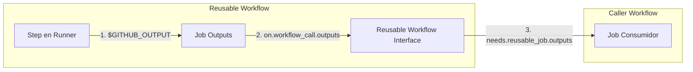

# Ejercicio 5: Troubleshooting en GitHub Actions 🚀

Este repositorio contiene la resolución detallada del **Ejercicio 5 — Troubleshooting**, enfocado en analizar, diagnosticar y resolver flujos de trabajo (workflows) defectuosos o problemáticos en **GitHub Actions**.

A continuación, se presenta un análisis exhaustivo para cada uno de los tres casos planteados.

---

## 📋 Tabla de Contenidos
1. [Caso A: Pipeline no ejecuta el Deploy a pesar de que los Tests son correctos](#-caso-a-pipeline-no-ejecuta-el-deploy-a-pesar-de-que-los-tests-son-correctos)
2. [Caso B: Una Matrix genera más Jobs de los esperados](#-caso-b-una-matrix-genera-más-jobs-de-los-esperados)
3. [Caso C: Un Reusable Workflow no recibe u obtiene correctamente los Outputs](#-caso-c-un-reusable-workflow-no-recibe-u-obtiene-correctamente-los-outputs)
4. [🛠️ Verificación y Buenas Prácticas Generales](#%EF%B8%8F-verificación-y-buenas-prácticas-generales)

---

## 🔍 Caso A: Pipeline no ejecuta el Deploy a pesar de que los Tests son correctos

### 💡 1. Posibles Causas
Cuando un flujo de trabajo ejecuta y aprueba todos los tests pero se salta o no ejecuta el paso o job de despliegue (`deploy`), las causas más comunes son:

*   **Filtros de Ramas, Tags o Eventos (`on`):** El workflow completo o el job de deploy está configurado para ejecutarse únicamente ante ciertos eventos (ej. `release` o push a `main`), mientras que los tests se ejecutan en cualquier rama o ante `pull_request`.
*   **Condicionales `if` Evaluados como Falsos:** El job de deploy contiene una expresión condicional `if:` que se evalúa como `false` en la ejecución actual. Ejemplos comunes:
    *   `if: github.ref == 'refs/heads/main'` pero la rama por defecto del repositorio se llama `master` o la ejecución es sobre una rama de desarrollo.
    *   `if: success()` mal ubicado o mal formateado.
    *   Errores tipográficos en variables de contexto (ej. `${{ github.event_name == 'push' }}` escrito incorrectamente).
*   **Omisión de Dependencias (`needs` & `skipped` states):** Si el job de `deploy` depende de un job intermedio (por ejemplo, un job de `build` o `approval`) usando `needs: [build]`, y ese job intermedio se omitió (`skipped`) o falló, el job de `deploy` se omitirá automáticamente por defecto.
*   **Políticas de Protección de GitHub Environments:** Si el deploy está asociado a un `environment` (ej. `production`) y este tiene configurado:
    *   **Required Reviewers (Revisores requeridos):** El pipeline se detiene esperando aprobación manual y, si nadie aprueba dentro del límite de tiempo (hasta 30 días), el deploy se cancela o se marca como fallido.
    *   **Deployment Branch Policies:** Si la rama actual no está autorizada para desplegar en ese entorno según las reglas de protección del Environment.
*   **Grupo de Concurrencia Activo (`concurrency`):** Si se utiliza un grupo de concurrencia (ej. `concurrency: production`) con `cancel-in-progress: true`, un push posterior en la misma rama cancelará automáticamente las ejecuciones previas que estén encoladas o en ejecución antes de que alcancen el paso de deploy.
*   **Permisos Insuficientes del `GITHUB_TOKEN`:** El paso de deploy puede requerir permisos de escritura (como `deployments: write` o `contents: write`) para interactuar con la API de GitHub o plataformas de hosting, y si no están explíxicamente declarados, el job puede fallar inmediatamente o ser bloqueado.

---

### 🩺 2. Cómo Diagnosticar el Problema
Para identificar cuál de las causas anteriores está impidiendo el deploy, se deben seguir los siguientes pasos:

```mermaid
graph TD
    A[Inicio: Deploy no Ejecutado] --> B{¿El job de Deploy aparece en gris/Skipped?}
    B -- Sí -- > C[Revisar condicionales 'if' e historial de dependencias 'needs']
    B -- No -- > D{¿El job está en amarillo/Pausado?}
    D -- Sí -- > E[Revisar aprobaciones pendientes en Settings > Environments]
    D -- No -- > F{¿El job falló o no aparece en el grafo?}
    F -- No aparece -- > G[Verificar filtros de eventos 'on' y filtros de rama 'branches']
    F -- Falló -- > H[Revisar logs detallados y permisos de GITHUB_TOKEN]
```

1.  **Inspeccionar el Grafo del Workflow (Workflow Visualizer):**
    *   Acceder a la pestaña **Actions** en GitHub.
    *   Seleccionar la ejecución del workflow afectada.
    *   Observar el estado visual del job de deploy:
        *   **Gris con un icono de omitido (🚫 o ⏭️):** Significa que el job fue filtrado por un condicional `if` o porque un job del que dependía (`needs`) no se completó satisfactoriamente.
        *   **Amarillo en pausa (⏳):** Significa que está esperando una aprobación manual del Environment.
        *   **No aparece en absoluto:** Indica que los filtros de eventos globales (`on`) a nivel de archivo YAML evitaron que ese fragmento o workflow se registrara.
2.  **Habilitar el Debug Logging de GitHub Actions:**
    *   Crear dos secretos en el repositorio (o definirlos como variables de entorno del sistema):
        *   `ACTIONS_STEP_DEBUG` establecido en `true`.
        *   `ACTIONS_RUNNER_DEBUG` establecido en `true`.
    *   Esto expondrá logs de depuración detallados en la consola, incluyendo cómo se evaluó cada condicional `if` línea por línea.
3.  **Inspeccionar el Contexto de GitHub:**
    *   Agregar temporalmente un paso en el workflow para imprimir las variables de entorno y el contexto completo del trigger para verificar los valores reales de las ramas y eventos:
        ```yaml
        - name: Dump GitHub Context
          run: echo "${{ toJSON(github) }}"
        ```
4.  **Verificar Configuración de Environments:**
    *   Ir a **Settings > Environments** y comprobar si el entorno al que se intenta desplegar tiene restricciones activas de ramas (`Deployment branches`) o revisores obligatorios.

---

### 🛠️ 3. Cómo Resolver el Problema
Dependiendo del diagnóstico, se deben aplicar las siguientes soluciones:

#### A. Corregir Filtros de Ramas y Eventos
Asegurar que el evento de despliegue esté habilitado para la rama correcta. Si queremos que los tests corran siempre, pero el deploy solo en `main`:

```yaml
# En el archivo de workflow (.github/workflows/caso_a_deploy.yml)
name: "Caso A: Deploy Seguro"

on:
  push:
    branches: [ main, develop ]
  pull_request:
    branches: [ main ]

jobs:
  test:
    runs-on: ubuntu-latest
    steps:
      - uses: actions/checkout@v4
      - name: Run Tests
        run: npm test

  deploy:
    runs-on: ubuntu-latest
    needs: test
    # CONDICIONAL SEGURO: Solo despliega si estamos en la rama main Y el job anterior fue exitoso
    if: github.ref == 'refs/heads/main' && github.event_name == 'push'
    environment: production
    steps:
      - uses: actions/checkout@v4
      - name: Deploy Application
        run: echo "Desplegando en producción..."
```

#### B. Resolver Bloqueos de Environments
*   Si el deploy está en pausa, designar un revisor que apruebe manualmente el deploy en la interfaz de GitHub.
*   Si se rechaza debido a una política de ramas, agregar la rama correspondiente (ej. `release/*` o `main`) en la configuración del Environment en GitHub.

#### C. Resolver Dependencias `needs` Omitidas
Si se usan workflows complejos donde un job intermedio puede fallar o cancelarse pero se desea desplegar igual (bajo ciertas condiciones), se puede usar la función `always()` o `success()` explícitamente:
```yaml
jobs:
  build:
    runs-on: ubuntu-latest
    steps:
      - run: echo "Construyendo..."
  
  deploy:
    needs: build
    if: |
      always() && 
      needs.build.result == 'success' && 
      github.ref == 'refs/heads/main'
    runs-on: ubuntu-latest
    steps:
      - run: echo "Desplegando..."
```

---

## 🧮 Caso B: Una Matrix genera más Jobs de los esperados

### 💡 1. ¿Por qué ocurre?
En GitHub Actions, la directiva `matrix` genera de manera predeterminada un **producto cartesiano** de todos los valores definidos en sus ejes. 

Si definimos una matriz con múltiples ejes de variación, la cantidad de jobs creados será la multiplicación del tamaño de cada eje:

$$\text{Total de Jobs} = |Eje_1| \times |Eje_2| \times |Eje_3| \dots$$

#### Ejemplo de Producto Cartesiano Descontrolado:
```yaml
strategy:
  matrix:
    os: [ubuntu-latest, windows-latest, macos-latest]   # 3 elementos
    node: [16, 18, 20]                                  # 3 elementos
    database: [postgres, mysql, sqlite]                 # 3 elementos
```
El pipeline generará automáticamente $3 \times 3 \times 3 = 27$ **jobs individuales**, lo cual consume rápidamente los minutos de ejecución de GitHub Actions y satura los runners disponibles.

---

### 🚨 2. Errores Comunes al Usar `include` y `exclude`

*   **Uso Incorrecto de `include` para "Añadir" casos aislados:**
    Muchos usuarios asumen que `include` sirve para agregar elementos de forma aislada a la lista. Sin embargo, si añades un objeto en `include` que tiene propiedades parciales o que no coinciden exactamente con los nombres de los ejes de la matriz, GitHub Actions podría generar jobs completamente nuevos en lugar de complementar los existentes.
    ```yaml
    # ERROR COMÚN: Genera jobs inesperados
    matrix:
      os: [ubuntu-latest, windows-latest]
      node: [18, 20]
      include:
        - os: macos-latest  # Agrega macos-latest pero NO especifica node, por lo que creará una nueva fila independiente sin valor de node definido o fallará
        - python-version: 3.10 # Esto crea un eje implícito nuevo que multiplica o añade jobs extraños.
    ```
*   **Errores de Tipografía en `exclude`:**
    Si intentas excluir combinaciones específicas pero cometes un error tipográfico en el nombre del eje o en el valor del elemento, GitHub Actions ignorará silenciosamente la regla de exclusión y ejecutará la combinación que querías evitar.
    ```yaml
    # ERROR COMÚN: Exclusión ignorada por error de tipografía
    matrix:
      os: [ubuntu-latest, windows-latest]
      node-version: [18, 20]
      exclude:
        - os: window-latest # Error tipográfico: faltó la 's' en windows-latest. El job en Windows se seguirá ejecutando.
          node-version: 18
    ```

---

### 🛠️ 3. Solución Propuesta

Para evitar que una matriz genere más jobs de los deseados, existen dos aproximaciones altamente eficientes:

#### Solución A: Utilizar una Matriz Definida por Inclusión Explícita (Recomendada)
En lugar de definir múltiples ejes combinatorios y luego podarlos con exclusiones complejas, se define una matriz vacía o con un solo eje dummy, y se declara la lista exacta de combinaciones a ejecutar mediante la directiva `include`.

```yaml
# SOLUCIÓN LIMPIA: Genera EXACTAMENTE 3 jobs muy específicos
strategy:
  matrix:
    # Definimos la lista exacta de entornos de prueba deseados sin hacer producto cartesiano
    include:
      - os: ubuntu-latest
        node-version: 18
        database: postgres
      - os: windows-latest
        node-version: 20
        database: sqlite
      - os: macos-latest
        node-version: 20
        database: mysql

runs-on: ${{ matrix.os }}
steps:
  - uses: actions/checkout@v4
  - name: Setup Node
    uses: actions/setup-node@v4
    with:
      node-version: ${{ matrix.node-version }}
  - name: Run Test on ${{ matrix.database }}
    run: echo "Probando en ${{ matrix.os }} con Node ${{ matrix.node-version }} y ${{ matrix.database }}"
```

#### Solución B: Poda Explícita usando `exclude`
Si se requiere la mayoría de las combinaciones pero se quieren evitar sistemas operativos o versiones incompatibles en particular, se debe utilizar `exclude` de forma muy precisa y con coincidencia exacta:

```yaml
# SOLUCIÓN POR EXCLUSIÓN: Genera 4 jobs (6 originales - 2 excluidos)
strategy:
  matrix:
    os: [ubuntu-latest, windows-latest, macos-latest]
    node-version: [18, 20]
    exclude:
      # macOS con Node 18 no es de interés para nuestro equipo
      - os: macos-latest
        node-version: 18
      # Windows con Node 18 no es necesario
      - os: windows-latest
        node-version: 18
```

> [!TIP]
> **Optimización de Recursos:** Siempre que uses matrices grandes, es recomendable limitar la concurrencia máxima agregando `max-parallel` dentro de `strategy` (ej. `max-parallel: 3`) para no bloquear todos los runners simultáneos de tu organización.

---

## 🔗 Caso C: Un Reusable Workflow no recibe u obtiene correctamente los Outputs

### 💡 1. Posibles Causas y Problemas de Ámbito (Scope)
El traspaso de outputs entre un **Workflow Reutilizable (Called Workflow)** y un **Workflow Principal (Caller Workflow)** suele fallar porque la información debe atravesar múltiples capas de ámbito (scopes) con sintaxis extremadamente estrictas. Si se rompe un solo enlace de la cadena de ámbitos, el output llegará vacío o provocará un error de referencia.



#### Errores Comunes de Scope y Configuración:
1.  **Falta de Exposición en la Interfaz `workflow_call`:** El workflow reutilizable tiene un output funcional a nivel de job, pero no lo expone en su declaración inicial de disparador `on.workflow_call.outputs`.
2.  **No Mapear el Output del Step al Output del Job:** En el workflow reutilizable, el job que ejecuta las tareas calcula un valor en un paso (Step) pero no lo mapea a la propiedad `outputs` a nivel de Job (`jobs.<job-id>.outputs`).
3.  **Uso de Sintaxis Obsoleta:** Escribir en la consola usando el comando obsoleto `echo "::set-output name=my_var::value"` en lugar del archivo de entorno moderno `echo "my_var=value" >> $GITHUB_OUTPUT`.
4.  **Ausencia de la Directiva `needs` en el Caller Workflow:** El workflow llamador intenta acceder al output de un job reutilizable en un job posterior, pero no declara explícitamente `needs: <reusable-job-id>`. Sin la relación `needs`, el contexto del job previo está completamente fuera de ámbito y no se puede leer.
5.  **Confusión de Contextos en el Caller:** Intentar acceder al output usando el objeto `steps` (ej. `${{ steps.reusable-step.outputs.var }}`) en lugar del objeto `needs` a nivel de job llamador (ej. `${{ needs.reusable-job.outputs.var }}`).

---

### 🛠️ 2. Solución Completa y Estructurada

Para solucionar este problema de raíz, a continuación se proporciona el código de implementación perfecto, mostrando cómo fluyen los datos a través de todos los ámbitos correctos.

#### Paso A: Definición del Workflow Reutilizable (`.github/workflows/caso_c_reusable.yml`)
Este archivo debe:
1. Declarar la interfaz de salida en `on.workflow_call.outputs`.
2. Mapear el output del job al output del paso correspondiente.
3. Escribir correctamente el valor en `$GITHUB_OUTPUT`.

```yaml
# Archivo: .github/workflows/caso_c_reusable.yml
name: "Caso C: Reusable Workflow"

on:
  workflow_call:
    # 1. Declaramos qué outputs expone este workflow hacia el exterior
    outputs:
      generated-token:
        description: "Token temporal generado en el workflow reutilizable"
        value: ${{ jobs.process-data.outputs.token-output }}

jobs:
  process-data:
    runs-on: ubuntu-latest
    # 2. Mapeamos el output del Job apuntando al output específico del Step
    outputs:
      token-output: ${{ steps.generator-step.outputs.temp-token }}
      
    steps:
      - name: Generate Random Token
        id: generator-step
        # 3. Escribimos la variable de forma segura en $GITHUB_OUTPUT
        run: |
          TOKEN_VALUE="JWT_TOKEN_SECRET_XYZ_$(date +%s)"
          echo "temp-token=$TOKEN_VALUE" >> $GITHUB_OUTPUT
          echo "Token generado exitosamente en el paso interno."
```

#### Paso B: Definición del Workflow Llamador (`.github/workflows/caso_c_caller.yml`)
Este archivo debe:
1. Llamar al workflow reutilizable dándole un ID de job (ej. `call-reusable-workflow`).
2. Configurar un job posterior declarando la dependencia `needs: [call-reusable-workflow]`.
3. Consumir el output utilizando el objeto `needs`.

```yaml
# Archivo: .github/workflows/caso_c_caller.yml
name: "Caso C: Caller Workflow"

on:
  push:
    branches: [ main ]

jobs:
  # 1. Invocación del workflow reutilizable
  call-reusable-workflow:
    uses: ./.github/workflows/caso_c_reusable.yml

  # 2. Job consumidor que requiere los datos obtenidos
  consume-data:
    runs-on: ubuntu-latest
    # CRÍTICO: Sin 'needs' no se tiene acceso al ámbito de salida del job anterior
    needs: [call-reusable-workflow]
    steps:
      - name: Print Output from Reusable Workflow
        run: |
          # 3. Acceso correcto al output a través del contexto 'needs'
          echo "El token recibido del workflow reutilizable es:"
          echo "${{ needs.call-reusable-workflow.outputs.generated-token }}"
```

---

## 🛠️ Verificación y Buenas Prácticas Generales

Para evitar cometer errores de configuración y diagnosticar fallos de manera eficiente en el futuro, aplique las siguientes prácticas recomendadas para el mantenimiento de Pipelines:

*   **Utilizar Linter de YAML y GitHub Actions:** Herramientas como [actionlint](https://github.com/rhysd/actionlint) analizan de manera estática sus archivos YAML de workflows y detectan errores de tipografía, sintaxis inválida de matrices y accesos incorrectos a contextos antes de subir los cambios al repositorio.
*   **Mantener dependencias actualizadas de manera segura:** Fije las versiones de las acciones de terceros usando el hash SHA de commit completo en lugar de tags flotantes para evitar cambios de comportamiento inesperados.
*   **Proteger ramas de producción:** Configure reglas de protección sobre la rama `main` de este repositorio para asegurar que ningún cambio en los pipelines de despliegue se mezcle sin revisión previa de código.